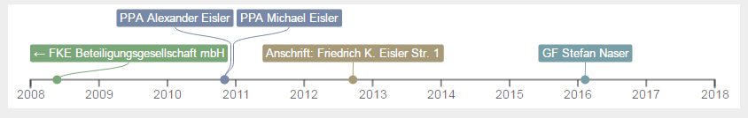
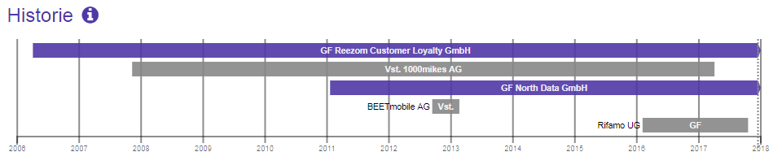
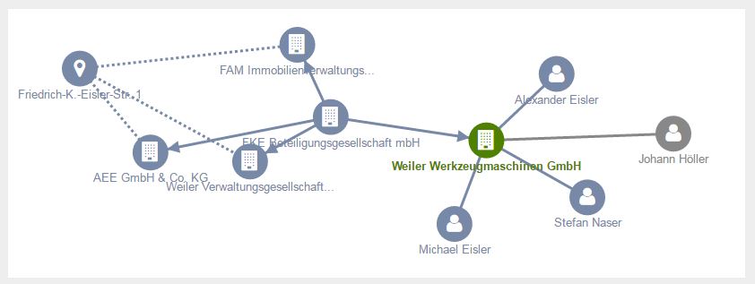
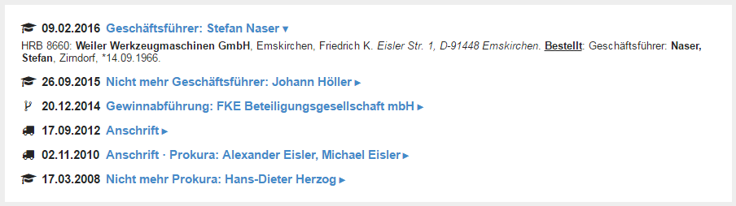
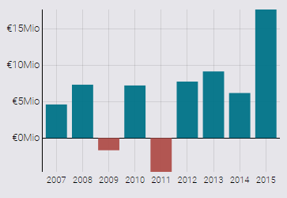
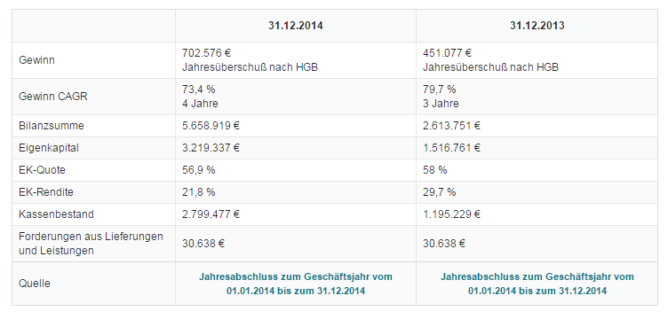
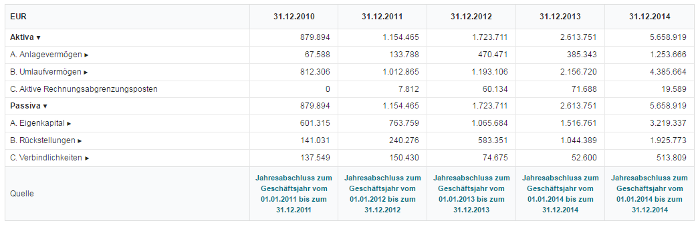
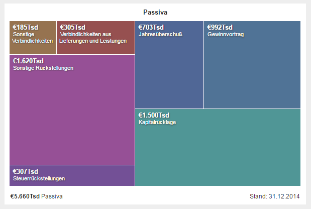
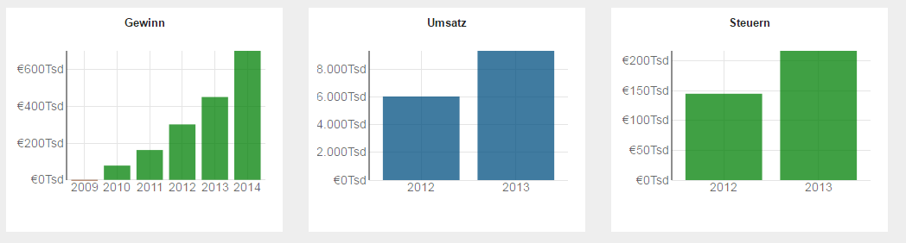

# North Data Widget API 

Zur Einbindung der Visualisierungen (interaktiven Grafiken) von North Data. 

## Inhaltsverzeichnis 

- [North Data Widget API](#north-data-widget-api)
  - [Inhaltsverzeichnis](#inhaltsverzeichnis)
  - [Übersicht](#übersicht)
    - [Künftige Widgets](#künftige-widgets)
  - [Einbindung von Widgets](#einbindung-von-widgets)
    - [Konfiguration](#konfiguration)
    - [Liste Widget-übergreifender Optionen](#liste-widget-übergreifender-optionen)
    - [Firmen-Identifikation](#firmen-identifikation)
    - [Autorisierung](#autorisierung)
    - [Abmessungen](#abmessungen)
    - [Navigation / Click Handler](#navigation--click-handler)
    - [Layout von Mehrfach-Grafiken / Item Handler](#layout-von-mehrfach-grafiken--item-handler)
  - [Widget-Referenz](#widget-referenz)
    - [Widget-Typ *"history"*](#widget-typ-history)
        - [Besondere Konfigurations-Optionen](#besondere-konfigurations-optionen)
    - [Widget-Typ *"vita"*](#widget-typ-vita)
        - [Besondere Konfigurations-Optionen](#besondere-konfigurations-optionen-1)
    - [Widget-Typ *"graph"*](#widget-typ-graph)
        - [Besondere Konfigurations-Optionen](#besondere-konfigurations-optionen-2)
    - [Widget-Typ *"pubTable"*](#widget-typ-pubtable)
      - [Besondere Konfigurations-Optionen](#besondere-konfigurations-optionen-3)
    - [Widget-Typ "*barChart"*](#widget-typ-barchart)
      - [Besondere Konfigurations-Optionen](#besondere-konfigurations-optionen-4)
    - [Widget-Typ "*financials"*](#widget-typ-financials)
      - [Besondere Konfigurations-Optionen](#besondere-konfigurations-optionen-5)
    - [Widget-Typ "*sheets"*](#widget-typ-sheets)
      - [Besondere Konfigurations-Optionen](#besondere-konfigurations-optionen-6)
    - [Widget-Typ "*drillDown"*](#widget-typ-drilldown)
      - [Besondere Konfigurations-Optionen](#besondere-konfigurations-optionen-7)

## Übersicht

Folgende Widgets sind aktuell verfübar:

<table>
  <thead>
  <tr>
    <th>type</th>
    <th>Beschreibung</th>
    <th>Bild</th>
    <th>Beispiel-Seite</th>
  </tr>
  </thead>
  <tr>
    <td>history</td>
    <td>Firmenhistorie (Timeline)</td>
    <td></td>
    <td><a href="https://www.northdata.de/widgetTestHistory.html">https://www.northdata.de/widgetTestHistory.html</a> </td>
  </tr>
  <tr>
    <td>vita</td>
    <td>Personenhistorie</td>
    <td></td>
    <td><a href="https://www.northdata.de/widgetTestVita.html">https://www.northdata.de/widgetTestVita.html</a> </td>
  </tr>
  <tr>
    <td>graph</td>
    <td>Netzwerk einer Firma oder Person</td>
    <td></td>
    <td><a href="https://www.northdata.de/widgetTestGraph.html">https://www.northdata.de/widgetTestGraph.html</a> </td>
  </tr>
  <tr>
    <td>pubTable</td>
    <td>Publikationen einer Firma oder Person</td>
    <td></td>
    <td><a href="https://www.northdata.de/widgetTestPubTable.html">https://www.northdata.de/widgetTestPubTable.html</a> </td>
  </tr>
  <tr>
    <td>barChart</td>
    <td>Balkendiagramm für finanzielle Kennzahlen</td>
    <td></td>
    <td><a href="https://www.northdata.de/widgetTestBarChart.html">https://www.northdata.de/widgetTestBarChart.html</a></td>
  </tr>
  <tr>
    <td>sheet</td>
    <td>Tabellarische Darstellung der Bilanz oder GuV</td>
    <td></td>
    <td><a href="https://www.northdata.de/widgetTestSheet.html">https://www.northdata.de/widgetTestSheet.html</a></td>
  </tr>
  <tr>
    <td>financials</td>
    <td>Tabelle mit finanziellen Kennzahlen</td>
    <td></td>
    <td><a href="https://www.northdata.de/widgetTestFinancials.html">https://www.northdata.de/widgetTestFinancials.html</a> </td>
  </tr>
  <tr>
    <td>drillDown</td>
    <td>Darstellung der Größe der wichtigsten Jahresabschlussposten als unterteiltes Rechteck</td>
    <td></td>
    <td><a href="https://www.northdata.de/widgetTestDrillDown.html">https://www.northdata.de/widgetTestDrillDown.html</a> </td>
  </tr>
</table>

### Künftige Widgets

Folgende Widgets werden in Kürze verfügbar sein:

| Beschreibung | Status |
| --- | --- |
| Firmen-Stammdaten | Abgeschlossen, Dokumentation fehlt |
| Personen-Stammdaten | Abgeschlossen, Dokumentation fehlt |
| Firmensuche | Abgeschlossen, Dokumentation fehlt |
| Powersuche | In Entwicklung |
| Interaktive Karte | In Entwicklung |

## Einbindung von Widgets

Zur Einbindung werden benötigt:

1. North Data Widget Bibliothek `northdata-viz`
2. Externes Stylesheet
3. Initialisierungscode und Konfigurationscode pro Widget

### 1. North Data Widget Bibliothek:

#### Über externes Script

Die Widget Bibliothek kann über das Script eingebunden werden:

```html
<script src="https://www.northdata.de/js/viz.min.js"></script>
```

Alternativ stehen verschiedene CDN-Dienste zur Verfügung, die das Einbinden des Scripts erleichtern wie zum Beispiel:

- [jsDelivr](https://www.jsdelivr.com/package/npm/northdata-viz)
- [UNPKG](https://www.unpkg.com/browse/northdata-viz/)

#### Über npm

Das Script kann ebenso mithilfe von [npm](https://www.npmjs.com/package/northdata-viz) bezogen werden:

```
npm install northdata-viz
```

Danach kann die Bibliothek wie folgt importiert werden:

```javascript
import * as NorthData from "northdata-viz";
```

### 2. Externes Stylesheet:

Das externe Stylesheet wird über den folgenden Tag im `<head>` des HTML-Dokuments eingebunden.

```html
<link
  href="https://www.northdata.de/viz.css?color1=%23ff0000&color2=%2300ff00&color3=%230000ff"
  rel="stylesheet"
/>
```

Über die drei Parameter kann die Farbgebung in der Netzwerkdarstellung angepasst werden:

- `color1` - Farbe des primären Knoten (Farbwert im Beispiel `#ff0000`)
- `color2` - Farbe der anderen Knoten (Farbwert im Beispiel `#00ff00`)
- `color3` - Farbe der anderen Knoten bei Mouse-Hover (Farbwert im Beispiel `#0000ff`)

### 3. Initialisierung und Konfiguration der Widgets per Javascript:

Die Bibliothek muss vor der Erstellung von Visualisierungen einmalig initialisiert werden:

```javascript
NorthData.initialize();
```

Für jede Visualisierung muss ein HTML-Element angelegt werden.
Dieses HTML-Element dient als "Root-Element" für das Widget-Objekt und wird anschließend per Javascript konfiguriert.

Beispiel Initialisierung eines Graph-Widgets:

```html
<figure
  id="myFigure"
  data-type="graph"
  data-name="Weiler Werkzeugmaschinen GmbH"
  data-address="Emskirchen"
  data-min-height="300"
></figure>
```

```javascript
new NorthData.Widget(document.getElementById("myFigure"), {
  /* Konfiguration */
});
```

### Konfiguration

Die Optionen können entweder als zweiter Parameter in Javascript übergeben werden, oder als Data-Attribute am HTML-Element gesetzt werden.

Beispiel Javascript:

```javascript
new NorthData.Widget(document.getElementById("myFigure"), {
  type: "history",
  apiKey: "abcd-wxyz",
  name: "Weiler Werkzeugmaschinen GmbH",
  address: "Emskirchen",
  minHeight: 300,
  success: function () {
    console.info("ok");
  },
  error: function (error) {
    console.error(error);
  },
});
```

Beispiel HTML-Element:

```html
<figure
  id="myFigure"
  data-type="graph"
  data-name="Weiler Werkzeugmaschinen GmbH"
  data-address="Emskirchen"
  data-min-height="300"
  data-api-key="abcd-wxyz"
></figure>
```

**Wichtig**: HTML-Data-Attributes werden mit Bindestrichen formatiert, nicht als Camel-Case. Also `minHeight` in Javascript entspricht `data-min-height` in HTML.

Javascript-Optionen und HTML-Data-Attribute können auch frei kombiniert werden. Die Javascript-Optionen überschreiben dabei die Data-Attribute.

Bei Javascript-Optionen vom Typ Zahl oder String können auch Funktionen verwendet werden, die passende Werte zurückliefern.

### Liste Widget-übergreifender Optionen

<table>
  <tr>
    <td>Name</td>
    <td>Typ</td>
    <td>Erklärung</td>
  </tr>
  <tr>
    <td>apiKey</td>
    <td>String</td>
    <td>API Key (siehe Autorisierung)</td>
  </tr>
  <tr valign="top">
    <td>type</td>
    <td>String</td>
    <td>Auswahl der grafischen Darstellung:
<ul><li>graph: Netzwerk der Person bzw. der Firma</li>
<li>history: Historie (Timeline)</li>
<li>barChart: Balkendiagramm</li>
<li>sheet: tabellarische Darstellung der Bilanz/GuV</li>
<li>drillDown: Darstellung der Größe der wichtigsten Jahresabschlussposten als unterteiltes Rechteck</li>
<li>pubTable: Tabelle der neuesten Publikationen</li>
<li>dendrogram: Horizontale Baumdarstellung (auf northdata.de verwendet zur Darstellung der Publikationsgliederung)</li></ul></td>
  </tr>
  <tr valign="top">
    <td>language</td>
    <td>String</td>
    <td>Sprache<ul>
<li>de: Deutsch (default)</li>
<li>en: Englisch (experimentell, wird ggf. noch nicht von allen Widgets unterstützt)</li></ul></td>
  </tr>
  <tr valign="top">
    <td>domain</td>
    <td>String</td>
    <td>Typ des dargestellten Objekts (optional)
<ul><li>company: Firma (default)</li>
<li>person: Person (in diesem Fall ist zudem die Option birthday notwendig)</li>
<li>hrb: Handelsregisterbekanntmachung</li></ul></td>
  </tr>
  <tr>
    <td>name</td>
    <td>String</td>
    <td>Name des Objekts, z.B. Firmenname, bei Personen im Format "Nachname, Vorname"</td>
  </tr>
  <tr>
    <td>address</td>
    <td>String</td>
    <td>optional, aber verbessert die Wahrscheinlichkeit eines eindeutigen Suchergebnis
Bsp: 
Strasse Nr. 123, 12345 Stadt
oder auch nur 
Hamburg</td>
  </tr>
  <tr>
    <td>registerCity</td>
    <td>String</td>
    <td>Sitz des Amtsgericht, optional, aber verbessert die Wahrscheinlichkeit eines eindeutigen Suchergebnis</td>
  </tr>
  <tr>
    <td>registerId</td>
    <td>String</td>
    <td>Handelsregister in der Form 
HRA 12345</td>
  </tr>
  <tr>
    <td>birthDay</td>
    <td>String</td>
    <td>Geburtstag im Format "YYYY-MM-TT" z.B. 1970-12-26</td>
  </tr>
  <tr>
    <td>minHeight</td>
    <td>Zahl</td>
    <td>minimale Höhe der Darstellung in Pixel</td>
  </tr>
  <tr>
    <td>maxHeight</td>
    <td>Zahl</td>
    <td>maximale Höhe in Pixel</td>
  </tr>
  <tr>
    <td>ratio</td>
    <td>Zahl</td>
    <td>fixes Verhältnis von Höhe zu Breite</td>
  </tr>
  <tr>
    <td>success</td>
    <td>Funktion</td>
    <td>wird aufgerufen, wenn das Widget erfolgreich erstellt wurde</td>
  </tr>
  <tr>
    <td>error</td>
    <td>Funktion</td>
    <td>wird im Fehler-Fall aufgerufen. Erhält als Argument eine Fehlermeldung oder ein Error-Objekt</td>
  </tr>
  <tr>
    <td>censor</td>
    <td>Boolean</td>
    <td>sollte auf true gesetzt werden, falls die Darstellung
      öffentlich erfolgt. 
    </td>
  </tr>
</table>


### Firmen-Identifikation

Die Firma wird über die Konfigurationsoptionen `name`, `address`, `registerCity` und `registerName` identifiziert.

1. Es muss mindestens die Kombination Name/Ort oder Amtsgericht/HR angegeben werden – idealerweise beide.

2. Verwenden Sie als Adresse einfach nur den Ort. Dies ist absolut ausreichend zur Identifikation: kleine Fehler der Adresse (Hausnummern!) können dazu führen, dass eine Firma nicht identifiziert wird.

3. Die Identifikation der Firma ist ansonsten weitgehend tolerant gegenüber verschiedenen Schreibweisen der Firma, früheren Namen/Orten, unterschiedlichen Schreibweisen des Orts, alten Formen des HR-Zeichen, etc.

### Personen-Identifikation

Eine Person wird über die Konfigurationsoptionen `name`, `address` und `birthDay` identifiziert.


### Autorisierung

Die Autorisierung erfolgt per API-Key (wie beim Daten-API), oder über die Freischaltung der Domain, wo die Widgets eingebunden werden. Um einen API-Key zu erhalten bzw. eine Domain freischalten zu lassen, wenden Sie sich bitte an North Data.

Der API-Key sollte nur beim Testen verwendet werden. Beim Testen ist der API Key meistens erforderlich, da die beim Testen verwendete Domain nicht freigeschaltet ist. 

Im Produktionsbetrieb sollte der API-Key nicht verwendet werden, da er im HTML-Source-Code sichtbar ist.

### Abmessungen

Widgets nutzen immer die vorgegebene Breite des HTML-Elements. Die Höhe passen sie aber zur optimalen Darstellung dynamisch an. 

### Navigation / Click Handler

Interaktivität und User Engagement der Netzwerk- und Historiendarstellung werden maßgeblich verbessert, wenn die Knoten anklickbar sind und weitere Seiten verlinken. Dazu können Click Event Handler über die Optionen `companyClick`, `personClick` und `publicationClick` definiert werden:

```javascript
function handleCompanyClick(node) {
  var hr = node.registerCity + " " + node.registerId  
  var url = "/companies.html?hr=" + encodeURIComponent(hr)
  window.location.assign(url)
}

new NorthData.Widget( myFigure, { 
  companyClick: handleCompanyClick,
  // personClick: …,
  // publicationClick: ...
})
```

Die  Optionen `companyClick`, `personClick` und `publicationClick` sollten nur gesetzt werden, wenn der Click tatsächlich behandlelt wird! (Grund: korrekte Darstellung des Mauszeigers.)

Die Attribute des der Funktion übergebenen Knoten (im Beispiel: `node`) sind in der folgenden Tabelle zusammengestellt.

<table>
  <tr>
    <td>Attribut</td>
    <td>Erläuterung</td>
  </tr>
  <tr>
    <td>name</td>
    <td>Name (z.B. Name der Firma oder der Person)</td>
  </tr>
  <tr>
    <td>text</td>
    <td>Beschriftung des Knotens (ggf. gekürzter Name)</td>
  </tr>
  <tr>
    <td>address</td>
    <td>Adresse (Firmen, Personen - falls bekannt)</td>
  </tr>
  <tr>
    <td>registerName</td>
    <td>Sitz des Amtsgericht (nur Firmen)</td>
  </tr>
  <tr>
    <td>registerId</td>
    <td>Handelsregister in der Form 
HRA 12345 (nur Firmen)</td>
  </tr>
  <tr>
    <td>firstName</td>
    <td>bei Personen</td>
  </tr>
  <tr>
    <td>lastName</td>
    <td>bei Personen</td>
  </tr>
  <tr>
    <td>birthDate</td>
    <td>bei Personen (falls bekannt)</td>
  </tr>
  <tr>
    <td>id</td>
    <td>interne North Data ID</td>
  </tr>
  <tr>
    <td>url</td>
    <td>bei Publikationen (in der Regel keine öffentliche URL, da die Publikationen nicht öffentlich sind. Kann aber als eindeutiger Schlüssel für eine Publikationen verwendet werden)</td>
  </tr>
  <tr>
    <td>hash</td>
    <td>bei Publikationen (Hashwert über den Publikationstext. Kann als Schlüssel verwendet werden)</td>
  </tr>
</table>

### Layout von Mehrfach-Grafiken / Item Handler

Verschiedene Widgets können mehrere Grafiken zu einer Firma erzeugen: Balkendiagramme (Widget-Type *barChart*) für Umsatz, Gewinn, usw., die tabellarische Darstellung der Bilanz neben der Bilanz auch eine Gewinn- und Verlustrechnung. 



Es gibt in diesem Fall viele Möglichkeiten der Darstellung: nebeneinander, untereinander, oder - häufig die eleganteste Lösung - in Tabs. Die Darstellung kann angepasst werden über einen Item-Handler:

```javascript
function wrapChart(title, element) {
  // wrap title and element in figure and legend tags
  var figure = document.createElement("figure")
  var legend = document.createElement("legend")
  legend.textContent = title
  figure.appendChild(legend)
  figure.appendChild(element)
  var chart = document.createElement("div")
  chart.className = "chart"
  chart.appendChild(legend)
  chart.appendChild(figure)
  return chart
}

new NorthData.Widget( myFigure, { 
  type: "barChart",
  handleItem: wrapChart
})
```

Dem Item-Handler werden die Überschrift der Grafik (z.B. "Gewinn") und das jeweilige Grafikelement übergeben. Der Rückgabewert ist das "neue Element", was dann in das Dokument eingefügt wird, oder null, falls nichts eingefügt wird (d.h., das komplette DOM-Handling von der Funktion übernommen wird). Beispiel siehe hier: [https://www.northdata.de/widgetTestBarChart.html](https://www.northdata.de/widgetTestPubTable.html) 

Ist kein Item-Handler definiert, wird nur die Überschrift in einen `<h2>`-Tag gesetzt.

## Widget-Referenz

Im folgenden werden die verschiedenen Widgets im Detail vorgestellt, und die nur für sie jeweils verfügbaren Konfigurations-Optionen aufgelistet.

### Widget-Typ *"history"*

Stellt die wichtigsten Ereignisse zu einer Firma als Timeline dar.
Beispielseite: [https://www.northdata.de/widgetTestHistory.html](https://www.northdata.de/widgetTestHistory.html)


##### Besondere Konfigurations-Optionen

<table>
  <tr>
    <td>Name</td>
    <td>Typ</td>
    <td>Erklärung</td>
  </tr>
  <tr>
    <td>type</td>
    <td>String</td>
    <td>Auswahl der grafischen Darstellung: history</td>
  </tr>
  <tr>
    <td>rootColor</td>
    <td>Farbe</td>
    <td>Farbe, auf deren Basis eine passende Farbpalette für die Färbung der Ereignisse erstellt wird.</td>
  </tr>
  <tr>
    <td>maxEvents</td>
    <td>Zahl</td>
    <td>Maximale Anzahl der angezeigten Ereignisse. Default: 25</td>
  </tr>
  <tr>
    <td>companyClick</td>
    <td>Funktion</td>
    <td>siehe Abschnitt Navigation / Click Handler</td>
  </tr>
  <tr>
    <td>personClick</td>
    <td>Funktion</td>
    <td>siehe Abschnitt Navigation / Click Handler</td>
  </tr>
  <tr>
    <td>publicationClick</td>
    <td>Funktion</td>
    <td>siehe Abschnitt Navigation / Click Handler</td>
  </tr>
</table>

### Widget-Typ *"vita"*

Stellt die wichtigsten Stationen einer Person in einer Timeline dar. 
Beispielseite: [https://www.northdata.de/widgetTestVita.html](https://www.northdata.de/widgetTestVita.html)


##### Besondere Konfigurations-Optionen

<table>
  <tr>
    <td>Name</td>
    <td>Typ</td>
    <td>Erklärung</td>
  </tr>
  <tr>
    <td>type</td>
    <td>String</td>
    <td>Auswahl der grafischen Darstellung: vita</td>
  </tr>
  <tr>
    <td>maxLines</td>
    <td>Zahl</td>
    <td>Maximale Anzahl der angezeigten Zeilen. Default: 15</td>
  </tr>
  <tr>
    <td>companyClick</td>
    <td>Funktion</td>
    <td>siehe Abschnitt Navigation / Click Handler</td>
  </tr>
</table>


### Widget-Typ *"graph"*

Stellt das Netzwerk einer Firma oder Person, d.h. die Verflechtungen mit Firmen (Beherrschungen, Komplementäre, etc.) und Personen (Geschäftsführer, Vorstände, etc.) als Graph dar.

Beispielseite: [https://www.northdata.de/widgetTestGraph.html](https://www.northdata.de/widgetTestGraph.html) 


##### Besondere Konfigurations-Optionen

<table>
  <tr>
    <td>Name</td>
    <td>Typ</td>
    <td>Erklärung</td>
  </tr>
  <tr>
    <td>type</td>
    <td>String</td>
    <td>Auswahl der grafischen Darstellung: graph</td>
  </tr>
  <tr>
    <td>maxNodes</td>
    <td>Zahl</td>
    <td>bei Layouts "graph", "dendrogram": Maximale Anzahl der angezeigten Knoten. Default: 12</td>
  </tr>
  <tr>
    <td>companyClick</td>
    <td>Funktion</td>
    <td>siehe Abschnitt Navigation / Click Handler</td>
  </tr>
  <tr>
    <td>personClick</td>
    <td>Funktion</td>
    <td>siehe Abschnitt Navigation / Click Handler</td>
  </tr>
</table>

### Widget-Typ *"pubTable"*

Interaktive Liste von Publikationen (Handelsregister, Insolvenzregister) zur jeweiligen Firma. 

Beispielseite: [https://www.northdata.de/widgetTestPubTable.html](https://www.northdata.de/widgetTestPubTable.html) 

Die einzelnen Publikationen können durch Klick auf der Überschrift ein- und ausgeklappt werden. Semantische Konzepte wie Firmen oder Personen sind im HTML-Text markiert, und können per CSS in der Darstellung verändert werden.


#### Besondere Konfigurations-Optionen

<table>
  <tr>
    <td>Name</td>
    <td>Typ</td>
    <td>Erklärung</td>
  </tr>
  <tr>
    <td>type</td>
    <td>String</td>
    <td>Auswahl der grafischen Darstellung: pubTable</td>
  </tr>
  <tr>
    <td>maxRows</td>
    <td>Zahl</td>
    <td>Maximale Anzahl der angezeigten Elemente. Default: 25</td>
  </tr>
</table>

### Widget-Typ "*barChart"*

Stellt finanzielle Kennzahlen als Balkendiagramm dar.

Beispielseite: [https://www.northdata.de/widgetTestBarChart.html](https://www.northdata.de/widgetTestBarChart.html) 


#### Besondere Konfigurations-Optionen

<table>
  <tr>
    <td>Name</td>
    <td>Typ</td>
    <td>Erklärung</td>
  </tr>
  <tr>
    <td>type</td>
    <td>String</td>
    <td>Auswahl der grafischen Darstellung: barChart</td>
  </tr>
  <tr>
    <td>items</td>
    <td>Array of String</td>
    <td>Gewünschte Kennzahlen: Liste der IDs.  Default: ["earnings", "revenue", "tax", "employees"]. 
zu den möglichen IDs siehe Finanzielle Kennzahlen</td>
  </tr>
  <tr>
    <td>handleItem</td>
    <td>Funktion</td>
    <td>siehe Abschnitt Layout von Mehrfach-Grafiken / Item Handler</td>
  </tr>
  <tr>
    <td>colors</td>
    <td>Array von Farben</td>
    <td>3 Farbangaben, Nr. 1 für absolute Werte (z.B. Umsatz), Nr. 2 für positive (z.B. Gewinn), Nr. 3 für negative (z.B. Verlust)</td>
  </tr>
  <tr>
    <td>maxYears</td>
    <td>Zahl</td>
    <td>Maximale Anzahl der angezeigten Jahre. Default: 8 </td>
  </tr>
  <tr>
    <td>chronology</td>
    <td>String</td>
    <td>Zeitliche Reihenfolge: Wert "normal" für aufsteigend,  Wert "reverse" für absteigend. Default: "normal"</td>
  </tr>
</table>

### Widget-Typ "*financials"*

Stellt finanzielle Kennzahlen (soweit verfügbar) als Tabelle dar.

Beispiel: [https://www.northdata.de/widgetTestFinancials.html](https://www.northdata.de/widgetTestFinancials.html) 

Das Tabellen-"Basis-Styling" ist nur rudimentär, so dass Sie es problemlos nach Ihren Bedürfnissen anpassen können. Möchten Sie das nicht tun, kann ein erweitertes Styling über folgende CSS-Datei eingebunden werden:

[https://www.northdata.de/css/styling.css](https://www.northdata.de/css/styling.css) 


#### Besondere Konfigurations-Optionen

<table>
  <tr>
    <td>Name</td>
    <td>Typ</td>
    <td>Erklärung</td>
  </tr>
  <tr>
    <td>type</td>
    <td>String</td>
    <td>Auswahl der grafischen Darstellung: financials</td>
  </tr>
  <tr>
    <td>maxYears</td>
    <td>Zahl</td>
    <td>Maximale Anzahl der angezeigten Jahre. Default: 2 </td>
  </tr>
  <tr>
    <td>chronology</td>
    <td>String</td>
    <td>Zeitliche Reihenfolge: Wert "normal" für aufsteigend,  Wert "reverse" für absteigend. Default: "normal"</td>
  </tr>
  <tr>
    <td>sourceClick</td>
    <td>Funktion</td>
    <td>Durch Angabe einer Funktion function(source) kann das Standardverhalten beim Klick auf die Quellenangabe überschrieben werden. </td>
  </tr>
</table>

### Widget-Typ "*sheets"*

Stellt Bilanz und Gewinn-/Verlustrechnung (soweit verfügbar) als interaktive Tabelle dar. Summen-Zeilen können per Klick ein- und aufgeklappt werden.

Beispielseite: [https://www.northdata.de/widgetTestSheet.html](https://www.northdata.de/widgetTestSheet.html) 

Das Tabellen-"Styling" ist nur rudimentär, so dass sie es problemlos nach Ihren Bedürfnissen anpassen können. Möchten Sie das nicht tun, kann ein erweitertes Styling kann über folgende CSS-Datei eingebunden werden:

[https://www.northdata.de/css/styling.css](https://www.northdata.de/css/styling.css) 


#### Besondere Konfigurations-Optionen

<table>
  <tr>
    <td>Name</td>
    <td>Typ</td>
    <td>Erklärung</td>
  </tr>
  <tr>
    <td>type</td>
    <td>String</td>
    <td>Auswahl der grafischen Darstellung: financials</td>
  </tr>
  <tr>
    <td>maxYears</td>
    <td>Zahl</td>
    <td>Maximale Anzahl der angezeigten Jahre. Default: 2 </td>
  </tr>
  <tr>
    <td>chronology</td>
    <td>String</td>
    <td>Zeitliche Reihenfolge: Wert "normal" für aufsteigend,  Wert "reverse" für absteigend. Default: "normal"</td>
  </tr>
  <tr>
    <td>items</td>
    <td>Array of String</td>
    <td>Gewünschte Tabellen als Liste von Strings.
Default: ["balance", "income"]. Mögliche Angaben: 
balance - Bilanz
income - Gewinn- und Verlustrechnung</td>
  </tr>
  <tr>
    <td>handleItem</td>
    <td>Funktion</td>
    <td>siehe Abschnitt Layout von Mehrfach-Grafiken / Item Handler</td>
  </tr>
  <tr>
    <td>sourceClick</td>
    <td>Funktion</td>
    <td>Durch Angabe einer Funktion function({ publication }) kann das Standardverhalten beim Klick auf die Quellenangabe überschrieben werden. </td>
  </tr>
</table>

### Widget-Typ "*drillDown"*

Stellt die größten Positionen in den Ausgaben, Aktiva und Passiva des neuesten verfügbaren Jahresabschluss als untergliedertes Rechteck dar. Die Fläche der jeweiligen Boxen entspricht der Größe der Position, so dass die Größenverhältnisse auf den ersten Blick ersichtlich sind. In der Bilanz zusammengehörige Position erhalten "ähnliche" Farben.

Beispielseite: [https://www.northdata.de/widgetTestDrillDown.html](https://www.northdata.de/widgetTestDrillDown.html) 


#### Besondere Konfigurations-Optionen

<table>
  <tr>
    <td>Name</td>
    <td>Typ</td>
    <td>Erklärung</td>
  </tr>
  <tr>
    <td>type</td>
    <td>String</td>
    <td>Auswahl der grafischen Darstellung: drillDown</td>
  </tr>
  <tr>
    <td>rootColor</td>
    <td>Farbe</td>
    <td>Farbe, auf deren Basis eine passende Farbpalette erstellt wird.</td>
  </tr>
  <tr>
    <td>items</td>
    <td>Array of String</td>
    <td>Gewünschte Grafiken als Liste von Strings.
Default: ["cost", "assets", "liabilities"]. 
Mögliche Angaben: 
cost - Ausgaben
assets - Aktiva
liabilities - Passiva</td>
  </tr>
  <tr>
    <td>handleItem</td>
    <td>Funktion</td>
    <td>siehe Abschnitt Layout von Mehrfach-Grafiken / Item Handler</td>
  </tr>
</table>


